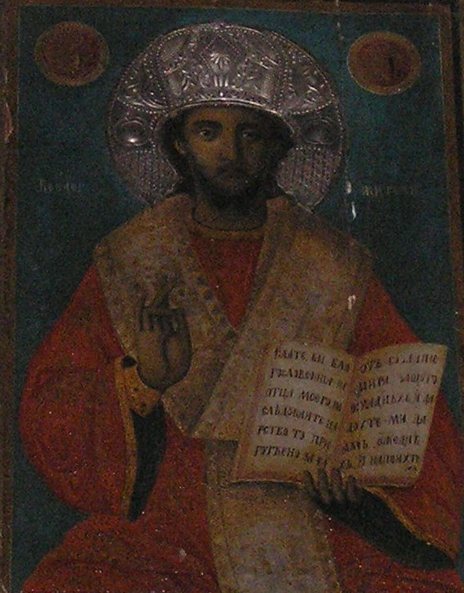
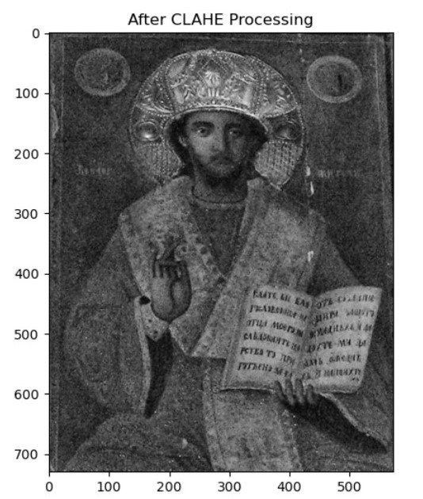

# 🎨 Orthodox Iconography & Data Science

## The Samokov School in a Global Digital Context

## 🖼️ Visual Insight: Revealing Hidden Detail

  
  

  <em>Left: Original image | Right: Enhanced using CLAHE (Contrast Limited Adaptive Histogram Equalization)</em>

This visual example illustrates how digital enhancement techniques can reveal details that are otherwise difficult to perceive, supporting the study of iconographic features and inscriptions.

---

## 🌟 Overview

This project explores the intersection of **Art History** and **Data Science**, focusing on the visual and symbolic language of Orthodox iconography.

Using a curated dataset of Christian artworks, it examines how iconographic attributes—such as the presence of the **Open Book**, **Throne**, and **Mandorla**—are distributed across different traditions and historical periods.

A particular emphasis is placed on the **Samokov Iconographic School**, whose integration into the dataset offers a valuable regional perspective and enriches the broader digital representation of Orthodox art.

---

## 🎯 Project Goals

* **Contextual Enrichment:** To complement global digital datasets with region-specific material from the Balkans
* **Comparative Analysis:** To explore relationships between Eastern and Western iconographic traditions
* **Digital Preservation:** To demonstrate how Computer Vision can support the study of visually degraded artworks

---

## 🔍 Key Insight

Initial observations based on widely accessible datasets suggest a limited presence of certain iconographic features within Orthodox imagery.

By incorporating works from the Samokov School, this project illustrates how the inclusion of regional material can **significantly expand and refine the overall picture**, offering a more nuanced understanding of artistic traditions.

---

## 🧪 Methodology

### 1. Dataset Construction

* Compilation of artworks from major international collections
* Annotation of iconographic attributes:

  * `throne`
  * `mandorla`
  * `book_open`

### 2. Comparative Analysis

* Grouping by tradition (Eastern / Western)
* Statistical evaluation of attribute presence
* Visualization through bar charts, histograms, and distributions

### 3. Dataset Extension

* Integration of a focused corpus from the Samokov School
* Re-evaluation of patterns after inclusion of regional data

---

## 📊 Selected Results

* The inclusion of Balkan material introduces **greater variability and richness** in the representation of Orthodox iconography
* The attribute of the **Open Book**, particularly associated with theological emphasis on the Logos, becomes significantly more visible within the expanded dataset
* Bulgaria emerges as an important contributor within this specific iconographic context

---

## 🖼️ Digital Enhancement (Computer Vision)

This project also demonstrates the application of **Contrast Limited Adaptive Histogram Equalization (CLAHE)** for the analysis of historical images.

### Why CLAHE?

* Enhances contrast in locally darkened regions
* Preserves structural integrity without over-amplifying noise
* Supports the visibility of fine details such as inscriptions

### Application in Art History

* Improved readability of texts in iconography
* Assistance in paleographic interpretation
* Non-invasive digital support for restoration workflows

---

## 🧰 Technologies Used

* **Python 3**
* **Pandas**, **NumPy** – data processing
* **Matplotlib**, **Seaborn** – visualization
* **OpenCV** – image processing

---

## 📂 Repository Structure

* `Pantokrator_vs_Maiestas.ipynb` – main research notebook
* `icon.jpg` – sample image for CLAHE demonstration
* `README.md` – project documentation

---

## 🌍 Research Perspective

Rather than replacing existing knowledge, this project aims to **complement and enrich** current digital resources by highlighting the importance of regional artistic traditions.

The Samokov School serves as a case study demonstrating how local archives can contribute meaningfully to a more comprehensive and balanced global understanding of Christian art.

---

## 🔮 Future Directions

* Expansion of regional datasets from Southeastern Europe
* Integration of OCR techniques for inscription analysis
* Development of tools for automated iconographic classification
* Exploration of AI-assisted interpretation frameworks

---

## 🎓 About the Author

This project is a digital extension of the doctoral research:

**"The Samokov Painters in the Revival Churches of the Kyustendil Region"**
*Desislava Strahilova Georgieva, PhD*

---

## 📜 Citation

If you use this project in academic work, please cite the original dissertation and this repository.

---

## 🤝 Acknowledgment

This project is developed with deep respect for the work of art historians, curators, and institutions whose efforts in preserving and digitizing cultural heritage make studies like this possible.
